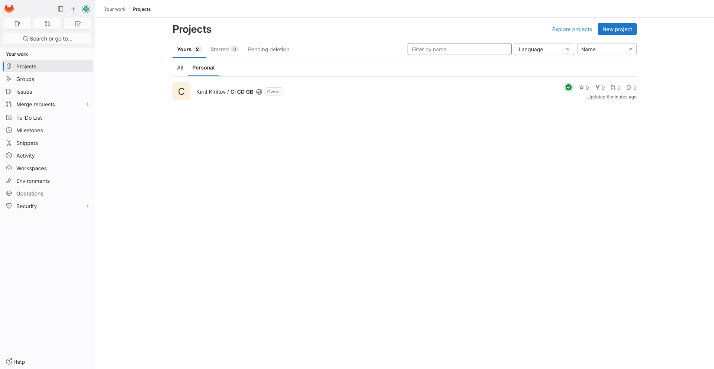

1. Зарегистрировался на платформе. Создал пустой проект:

2. Создал в проекте файл с именем `.gitlab-ci.yml` и заполнил его, добавив pages и исключив сразу two.html:

Всё пройдено успешно:

3. Переходим в `pages`:

4. Переходим по ссылке:

