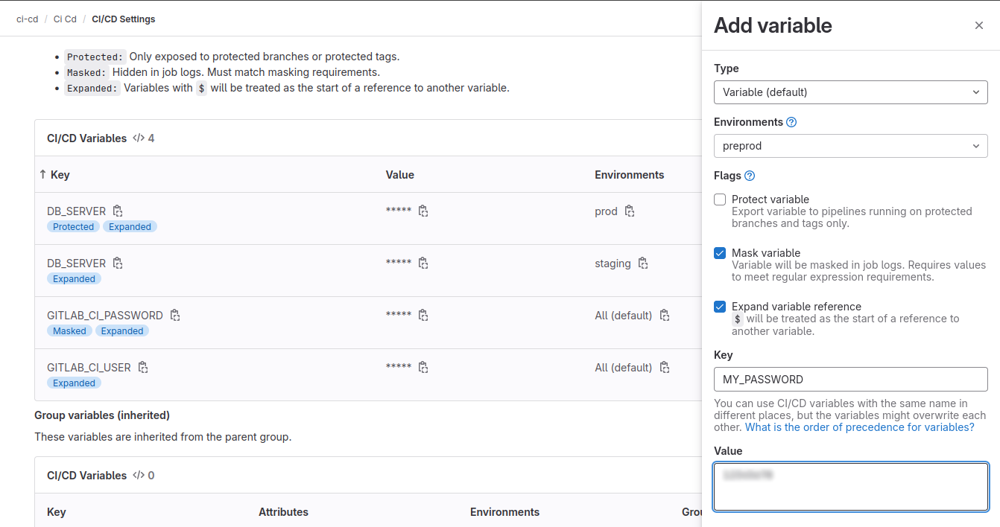
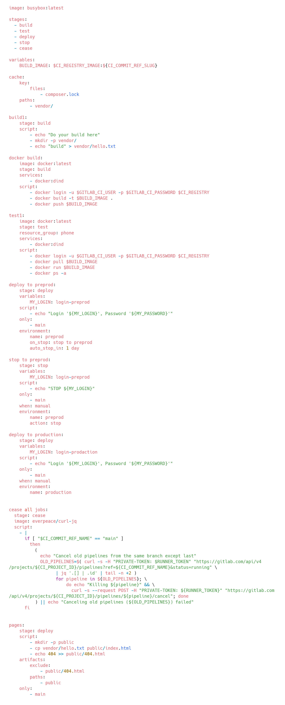
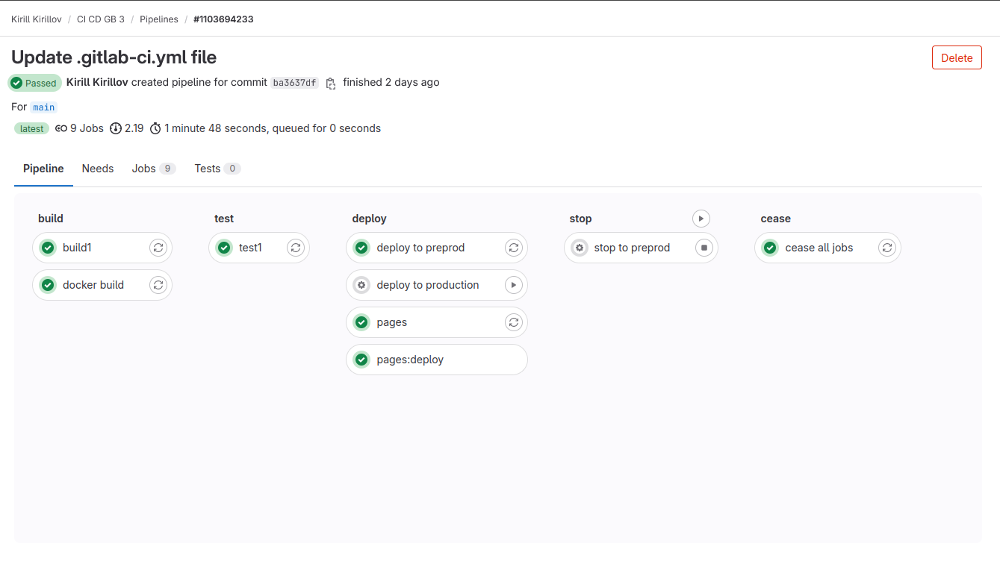
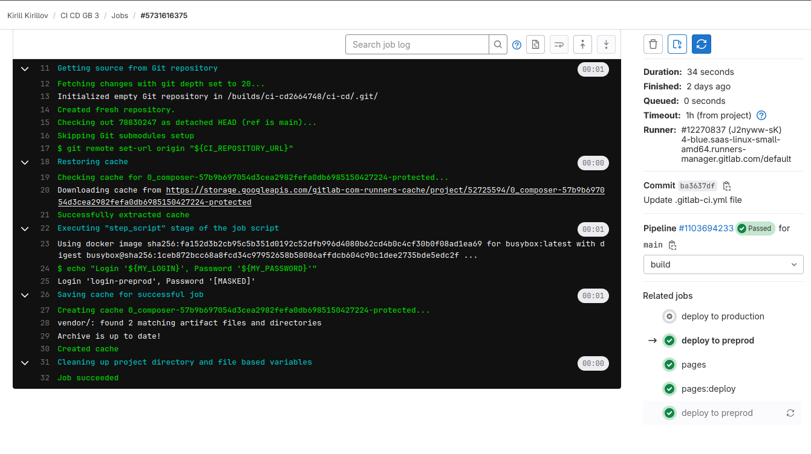

Создал джобы как в семинаре, прописал environments **preprod** и **production** и переменные **MY_LOGIN**. Переменные **MY_PASSWORD** созданы через настройки проекта в gitlab:

Для окружения **production** сделаны аналогичные настройки.

Код файла **YAML**`.gitlab-ci.yml`:

Пайплайн:

Сама джоба:

