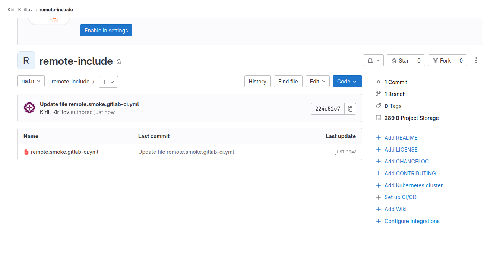
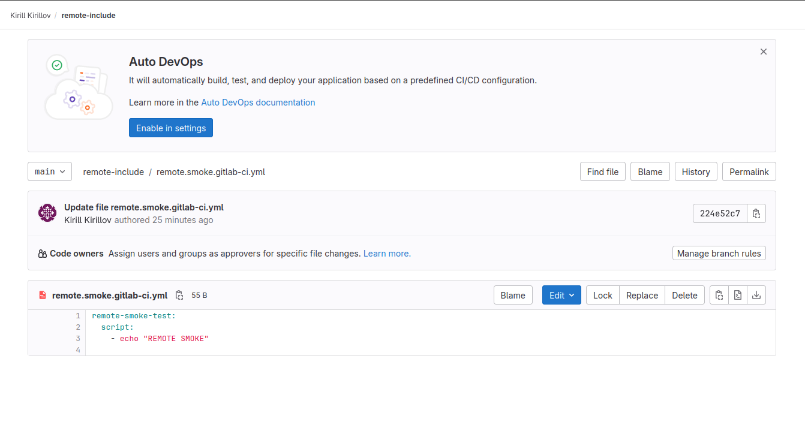
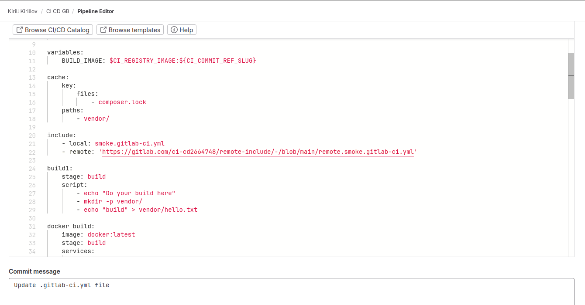
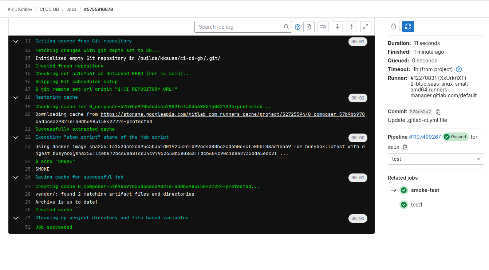
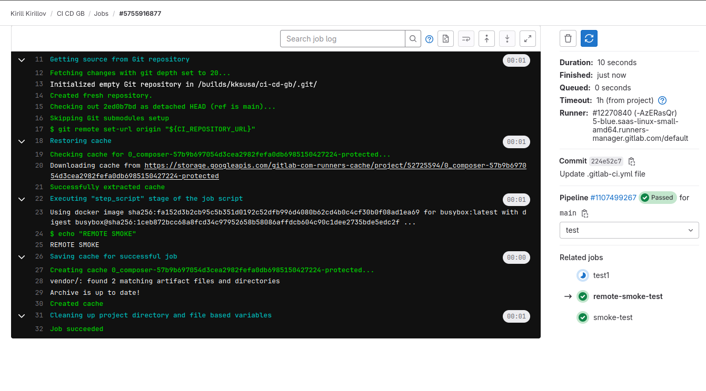

Создал файл с тестовой джобой в локальном репозитории. Создал проект и в нем создал файл еще с одной тестовой джобой:

Указал **include** в **pipeline** первого проекта:

Результат локальной тестовой джобы:

Результат удаленной тестовой джобы:

